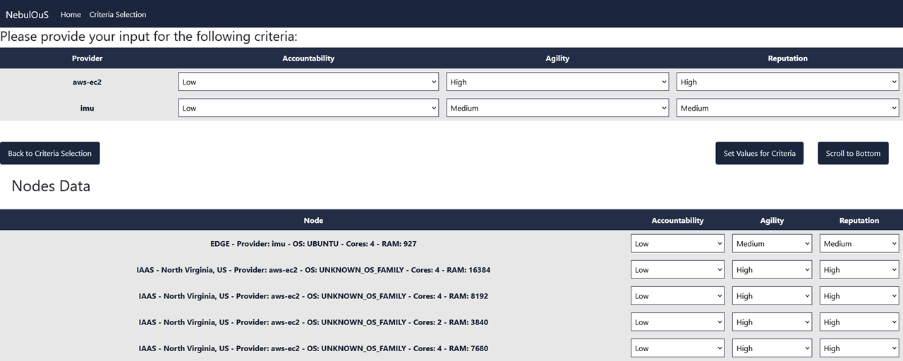
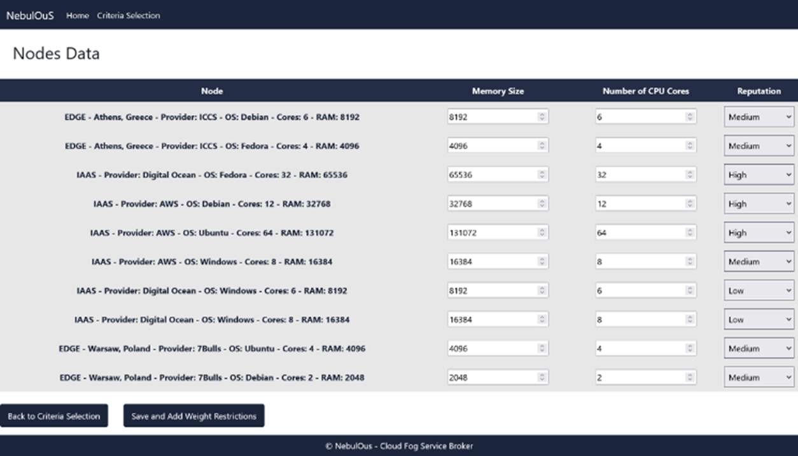
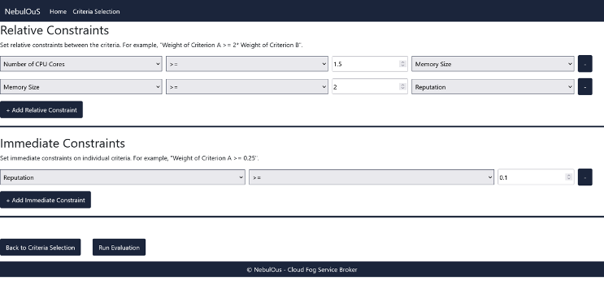
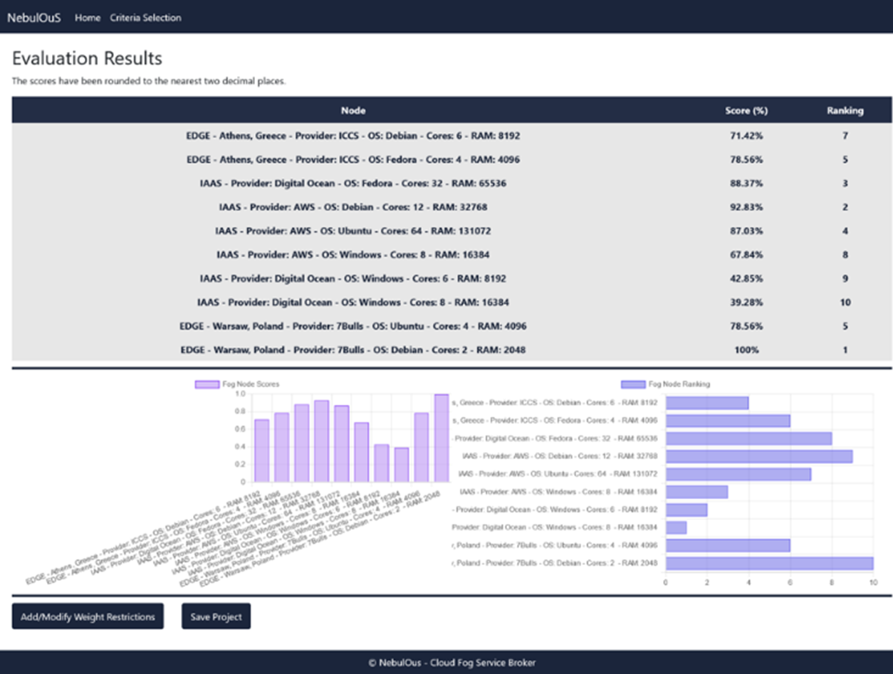

# Cloud Fog Service Broker (CFSB)

Cloud Fog Service Broker (CFSB) is designed to facilitate the evaluation and selection of the resources within the cloud continuum ecosystem. The CFSB employs Multiple-Criteria Decision Making (MCDM)  methods that rely on Mathematical Programming to assess resources based on multiple factors. This integration allows for a comprehensive assessment, ranking resources by synthesizing these diverse criteria and incorporating user preferences through weight restrictions in optimization models.

CFSB provides a GUI for the application owner to select the criteria an express his/her preferences over them. This information per application is stored to be used later when communicating with the Optimizer component and evaluating the available resources.

## Usage

CFSB can be accessed using application id and user id as parameters in the URL, e.g.,

https://cfsb.dev.nebulouscloud.eu/?appId=123a&nonce=gregk .

[Visit CFSB](https://cfsb.dev.nebulouscloud.eu/?appId=123a&nonce=gregk)

## Settings

CFSB enables the user to decide the policy used for the criteria in the evaluation.

- Rank at highest positions the resources with lower RAM and # of Cores (Minimal policy) or the opposite (Maximal policy)?
- The user can decide different policy for the same application since this information is stored for the future calls of Optimizer.

Also, CFSB filters the edge nodes based on the user choice about using all available nodes or specific ones for an application.

## Criteria

There is a wide [list of criteria](http://imu.ntua.gr/wp-content/uploads/2024/05/nebulous-preferences-model-21-11.drawio.png) from which the user can select for the evaluation. The values for some of them are calculated internally from Nebulous and CFSB, while others are given by the user. For instance, the values for criteria given by the user based on the Provider are Accountability, Reputation and Agility.

##

The information about each application is saved in order to be used whenever Optimizer component asks CFSB to evaluate the available resources for this specific application:

- Evaluation policy (Min/Max)
- Use of all edge nodes or application specific ones
- The user preferences expressed over the criteria
- Criteria values based on Providers

Cloud Fog Service Broker component is illustrated further by evaluating 10 available resources using 3 criteria, i.e., Memory Size, Number of Cores and Reputation, from the available list of criteria.

The criteria values of the resources are exhibited in the following figure. As it can be seen, three criteria were chosen, namely Memory Size, Number of CPU Cores and Reputation. The criterion Reputation is ordinal and receives values using a three point Likert scale {Low, Medium, High}.

The next figure presents the graphical interface where the user can express his preferences over the criteria, which are translated into relative and immediate constraints. For instance, the use believes that the criterion Memory Size is two times more important than the criterion Reputation. Also, the user imposes the immediate constraint on the weight that corresponds to criterion Reputation to receive a value higher than 0.1 from the optimization process.

## Results

The scores and ranking for the 10 available resources under evaluation are presented below. As we can see, only one resource is ranked at the first level. Namely, an edge device from 7Bulls located in Warsaw, with Debian operating system, 2 cores and 2048 MB RAM. Although there are available resources with better specifications, the result depicts the less the better policy assumed for this application.

In case the user changes the selected criteria and his/her preferences, then the previous stored data are replaced by the new input.

##

Funded by the European Union
